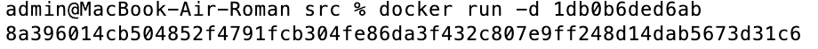
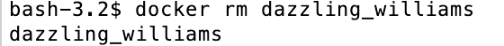

## Part 1. Готовый докер

##### Взять официальный докер образ с **nginx** и выкачать его при помощи `docker pull`

nginx pull

##### Проверить наличие докер образа через docker images

docker images

##### Запустить докер образ через docker run -d [image_id|repository]

docker run

##### Проверить, что образ запустился через docker ps

docker ps

##### Посмотреть информацию о контейнере через docker inspect [container_id|container_name]
container size
ports
container ip

##### Остановить докер образ через docker stop

docker stop

##### Проверить, что образ остановился через docker ps

docker ps

##### Запустить докер с замапленными портами 80 и 443 на локальную машину через команду run

docker run mapping

##### Проверить, что в браузере по адресу localhost:80 доступна стартовая страница nginx

browser

##### Перезапустить докер контейнер через docker restart [container_id|container_name]s

docker restart

##### Проверить любым способом, что контейнер запустился

docker ps

## Part 2. Операции с контейнером

##### Прочитать конфигурационный файл nginx.conf внутри докер контейнера через команду exec
nginx conf

##### Создать на локальной машине файл nginx.conf
new nginx conf

##### Настроить в нем по пути /status отдачу страницы статуса сервера nginx
/status

##### Скопировать созданный файл nginx.conf внутрь докер образа через команду docker cp
docker cp

##### Перезапустить nginx внутри докер образа через команду exec
restart nginx

##### Проверить, что по адресу localhost:80/status отдается страничка со статусом сервера nginx
/status

##### Экспортировать контейнер в файл container.tar через команду export

container.tar

##### Остановить контейнер
stop

##### Удалить образ через docker rmi [image_id|repository], не удаляя перед этим контейнеры
rmi force

##### Удалить остановленный контейнер
delete container

##### Импортировать контейнер обратно через команду import
import

##### Запустить импортированный контейнер
run container

##### Проверить, что по адресу localhost:80/status отдается страничка со статусом сервера nginx
status

## Part 3. Мини веб-сервер

